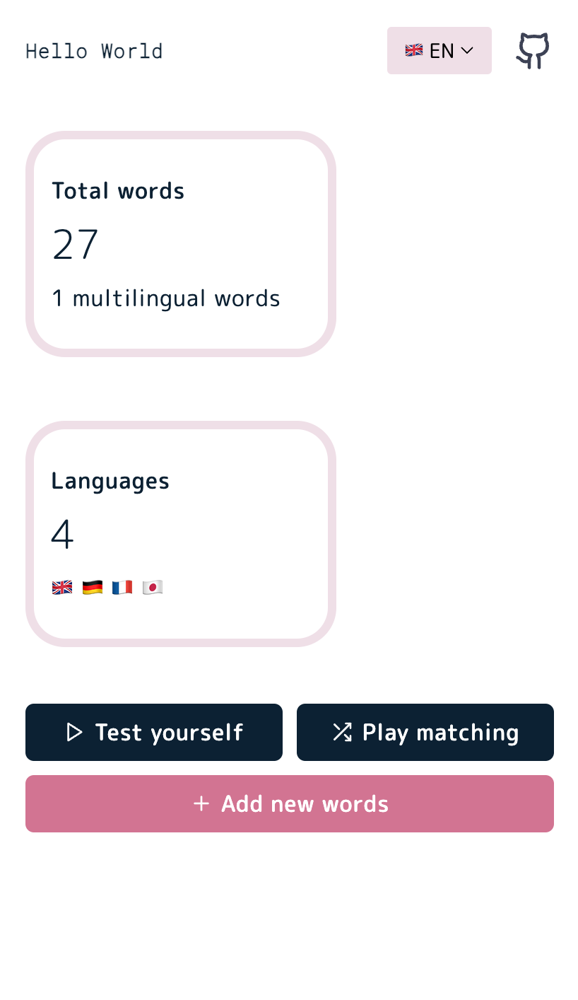
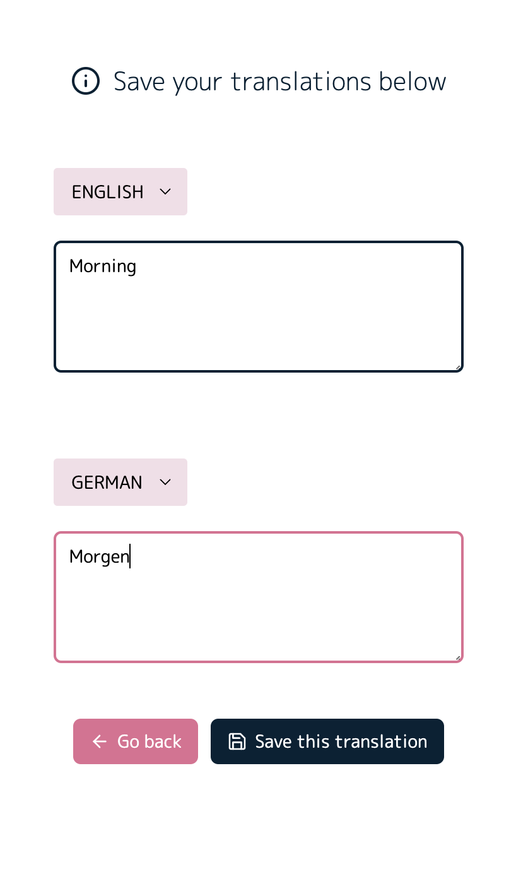
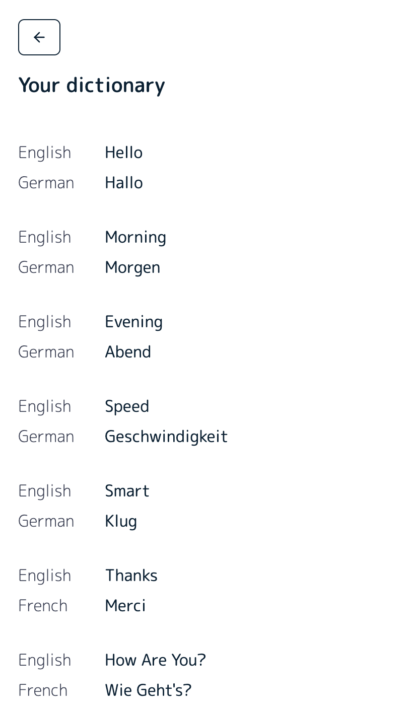
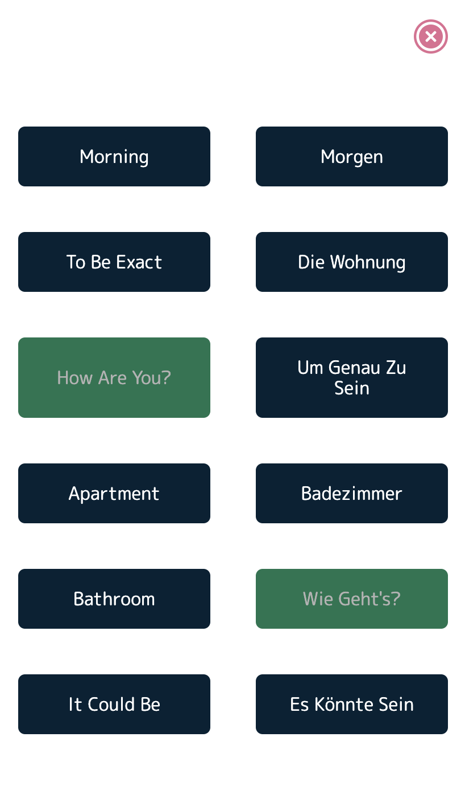
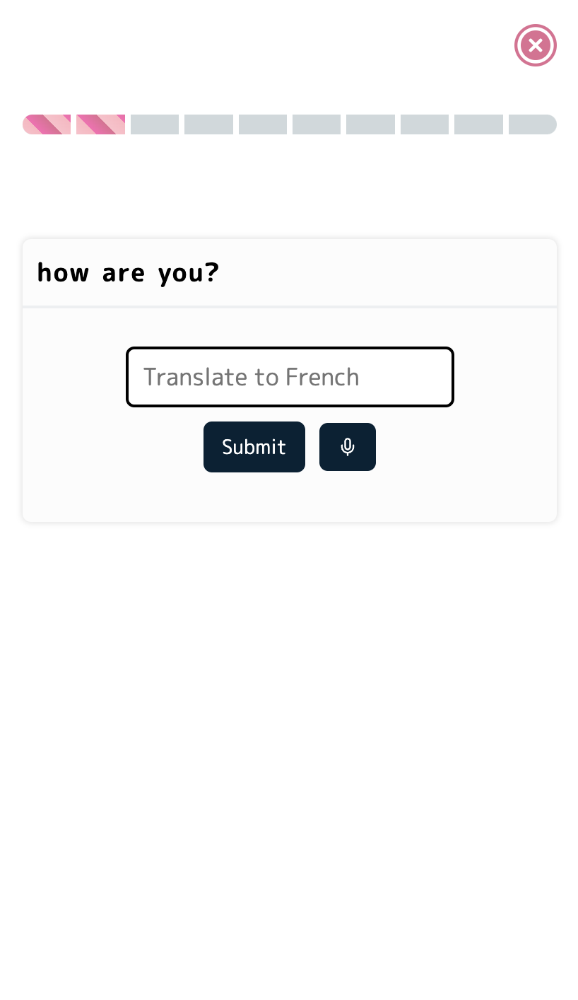

<h1 align="center">Entumany</h1>

## Features

- Users can add a custom dictionary of 2 or more languages.
- Play a randomised matching game.
- Play a randomised translation game.
- ✨ Install as PWA on your mobile device.
- No internet connection required, everything stays in localstorage.

    
    
    
    
    

## Contributing

We welcome all contributions.

- You can submit any ideas as Pull Request or Issues.
- If you'd like to improve code, make sure you stick to exisiting practices in code.

## License

Copyright (c) Mohit Kumar Yadav. All rights reserved.

